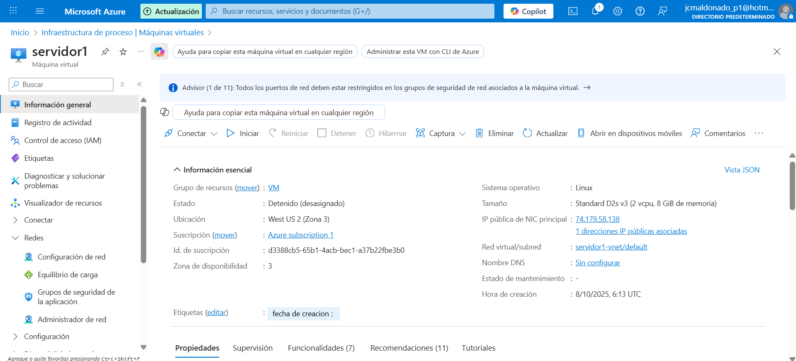
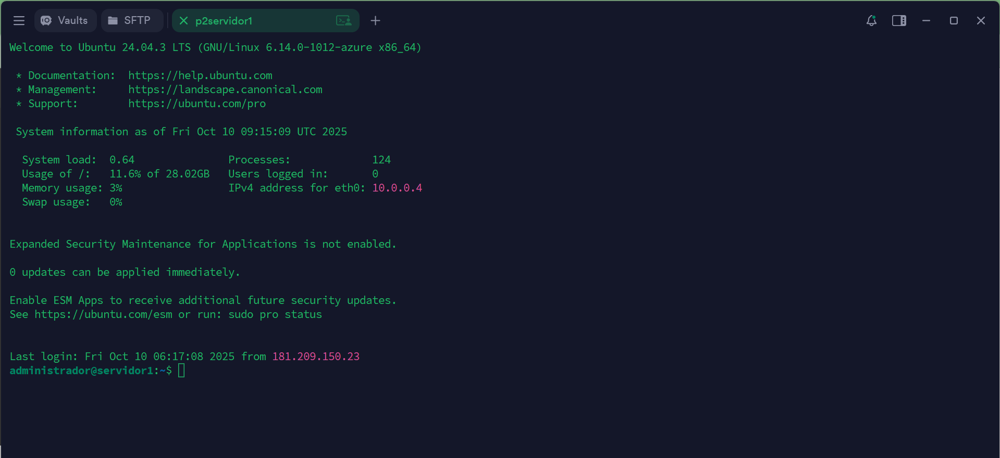
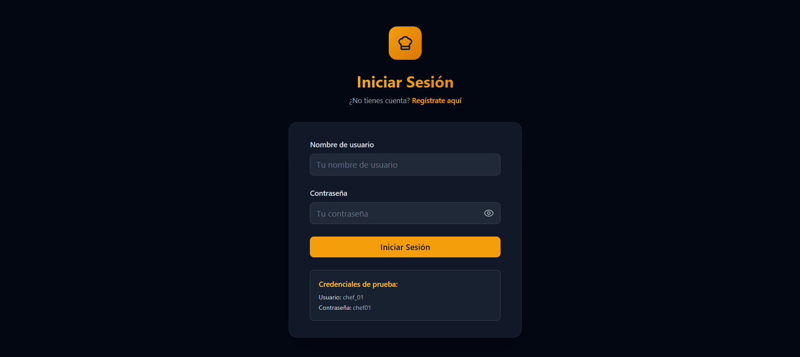
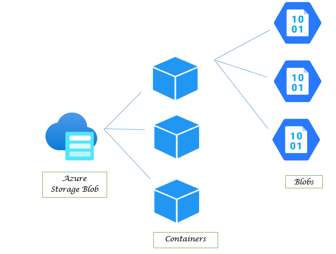
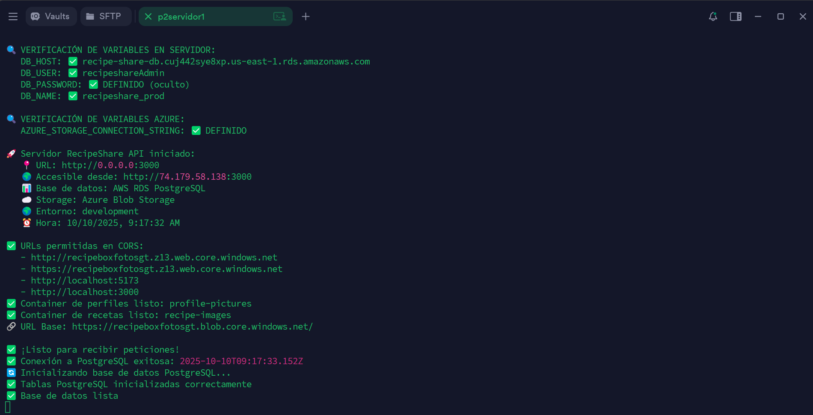
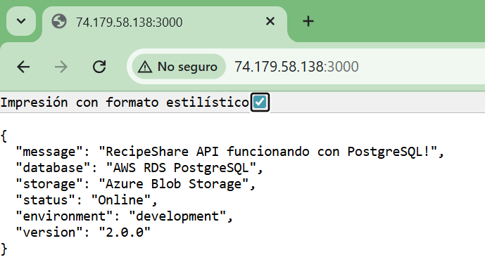
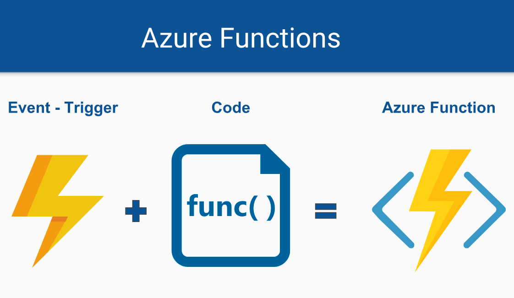
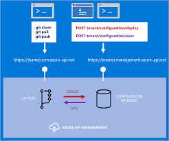
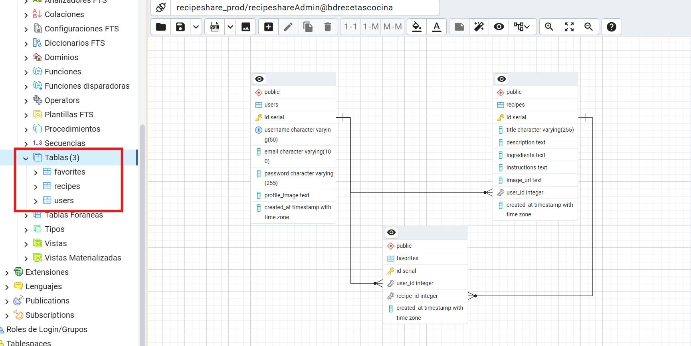

# RecipeBoxCloud  Azure &amp; AWS

## Seminario 1 Sección B Segundo Semestre 2025 
## Grupo # 6 

| NOMBRE                             | CARNET     |
|------------------------------------|------------|
| Tulio Jafeth Pirir Schuman         | 201700698  |
| Juan Carlos Maldonado Solorzano    | 201222687  |
| Geremias López Suruy               | 200313184  |

## Practica2

# 🍳 RecipeShare - Plataforma de Recetas Culinarias

## 📋 Tabla de Contenidos

## 📑 Contenido

1. [Descripción del Proyecto](#1-Descripción-del-Proyecto)
2. [Arquitectura del Sistema](#2-Arquitectura-del-Sistema)
3. [Capturas de pantalla de los recursos](#capturas-de-pantalla-de-los-recursos)
   - [a. Blob Containers de Azure](#a-blob-containers-de-azure)
   - [b. Instancias de VM de Azure: Servidor 1 en funcion](#b-instancias-de-vm-de-azure:-servidor-1-en-funcion)
   - [c. Funciones de Azure Functions](#c-funciones-de-azure-functions)
   - [d. Configuración de Api Management](#d-configuración-de-api-management)
4. [Base De Datos](#base-de-datos)
5. [Conclusión sobre las diferencias percibidas entre el desarrollo de Azure y AWS](#una-conclusión-sobre-las-diferencias-percibidas-entre-el-desarrollo-de-azure-y-aws)

---

## 1 Descripción del Proyecto

RecipeShare es una aplicación web full-stack que permite a los usuarios crear, compartir, explorar y guardar recetas de cocina. Desarrollada con arquitectura moderna y diseño responsivo.

### 🎨 Características Principales
- **Modo oscuro minimalista** - Interfaz elegante y moderna
- **Sistema de autenticación** - Registro y login seguro
- **Gestión completa de recetas** - CRUD operations
- **Sistema de favoritos** - Guardar recetas preferidas
- **Upload de imágenes** - Para perfiles y recetas
- **Búsqueda en tiempo real** - Filtrado instantáneo
- **Diseño responsive** - Compatible con todos los dispositivos

---

## 2 Arquitectura del Sistema

### 2. Descripción de la Arquitectura Utilizada

Nuestra solución de la aplicación web de recetas de cocina fue desplegada utilizando múltiples servicios en la nube, tanto de **Microsoft Azure** como de **AWS**. A continuación, se describe la arquitectura utilizada:

### 🔧 Backend (Servidor)
- Implementado en una **Azure Virtual Machine (VM)** con sistema operativo Linux.
- Alojamiento del backend (Node.js/Express).
- Gestión de lógica de negocio: autenticación, CRUD de recetas y manejo de favoritos.



### Utilizacion de termius para interactuar con el servidor



### 🗃️ Base de Datos
- **Amazon RDS (PostgreSQL)** fue utilizado para persistencia de datos estructurados.
- Encriptación de contraseñas utilizando `bcrypt`.
- Almacenamiento de URLs de imágenes (no imágenes directamente).


### 🖼️ Almacenamiento de Imágenes
- **Azure Blob Storage** utilizado para almacenar imágenes de perfil.
- Contenedor público con control de acceso para obtener URL públicas.

### ☁️ Arquitectura Serverless
- Uso de **Azure Functions** para cargar imágenes de perfil.
- Integración con **Azure API Management** para exponer la función como endpoint REST seguro.

### 🌐 Frontend
- Aplicación web desarrollada en HTML/CSS/JS (o framework de preferencia).
- Desplegada como sitio estático en **Azure Blob Storage (Static Website)**.




---

### a. Blob Containers de Azure



---

### b. Instancias de VM de Azure: Servidor 1 en funcion





---

### c. Funciones de Azure Functions



---

### d. Configuración de API Management



---

## 4 BASE DE DATOS

### CREACION DE BD EN AWS Y SU RESPECTIVA INFORMACION

```
# =============================================
# AWS RDS POSTGRESQL CONFIGURATION
# =============================================
DB_HOST=recipe-share-db.cuj442sye8xp.us-east-1.rds.amazonaws.com
DB_USER=recipeshareAdmin
DB_PASSWORD=Semi1_G6
DB_NAME=recipeshare_prod
DB_PORT=5432
```

### CREACION DE SCRIPT DE LA BASE DE DATOS

```
--
-- PostgreSQL database dump
--

\restrict cDMZ13WlrjuMgDpcvFdEiV1O2YFscP9miQW6iHDpb2gEP5mxVREkt3OgKk3cRo0

-- Dumped from database version 17.4
-- Dumped by pg_dump version 17.6

-- Started on 2025-10-10 02:23:50

SET statement_timeout = 0;
SET lock_timeout = 0;
SET idle_in_transaction_session_timeout = 0;
SET transaction_timeout = 0;
SET client_encoding = 'UTF8';
SET standard_conforming_strings = on;
SELECT pg_catalog.set_config('search_path', '', false);
SET check_function_bodies = false;
SET xmloption = content;
SET client_min_messages = warning;
SET row_security = off;

--
-- TOC entry 4336 (class 1262 OID 16415)
-- Name: recipeshare_prod; Type: DATABASE; Schema: -; Owner: recipeshareAdmin
--

CREATE DATABASE recipeshare_prod WITH TEMPLATE = template0 ENCODING = 'UTF8' LOCALE_PROVIDER = libc LOCALE = 'en_US.UTF-8';


ALTER DATABASE recipeshare_prod OWNER TO "recipeshareAdmin";

\unrestrict cDMZ13WlrjuMgDpcvFdEiV1O2YFscP9miQW6iHDpb2gEP5mxVREkt3OgKk3cRo0
\connect recipeshare_prod
\restrict cDMZ13WlrjuMgDpcvFdEiV1O2YFscP9miQW6iHDpb2gEP5mxVREkt3OgKk3cRo0

SET statement_timeout = 0;
SET lock_timeout = 0;
SET idle_in_transaction_session_timeout = 0;
SET transaction_timeout = 0;
SET client_encoding = 'UTF8';
SET standard_conforming_strings = on;
SELECT pg_catalog.set_config('search_path', '', false);
SET check_function_bodies = false;
SET xmloption = content;
SET client_min_messages = warning;
SET row_security = off;

--
-- TOC entry 4 (class 2615 OID 2200)
-- Name: public; Type: SCHEMA; Schema: -; Owner: pg_database_owner
--

CREATE SCHEMA public;


ALTER SCHEMA public OWNER TO pg_database_owner;

--
-- TOC entry 4337 (class 0 OID 0)
-- Dependencies: 4
-- Name: SCHEMA public; Type: COMMENT; Schema: -; Owner: pg_database_owner
--

COMMENT ON SCHEMA public IS 'standard public schema';


SET default_tablespace = '';

SET default_table_access_method = heap;

--
-- TOC entry 222 (class 1259 OID 16537)
-- Name: favorites; Type: TABLE; Schema: public; Owner: recipeshareAdmin
--

CREATE TABLE public.favorites (
    id integer NOT NULL,
    user_id integer,
    recipe_id integer,
    created_at timestamp with time zone DEFAULT CURRENT_TIMESTAMP
);


ALTER TABLE public.favorites OWNER TO "recipeshareAdmin";

--
-- TOC entry 221 (class 1259 OID 16536)
-- Name: favorites_id_seq; Type: SEQUENCE; Schema: public; Owner: recipeshareAdmin
--

CREATE SEQUENCE public.favorites_id_seq
    AS integer
    START WITH 1
    INCREMENT BY 1
    NO MINVALUE
    NO MAXVALUE
    CACHE 1;


ALTER SEQUENCE public.favorites_id_seq OWNER TO "recipeshareAdmin";

--
-- TOC entry 4338 (class 0 OID 0)
-- Dependencies: 221
-- Name: favorites_id_seq; Type: SEQUENCE OWNED BY; Schema: public; Owner: recipeshareAdmin
--

ALTER SEQUENCE public.favorites_id_seq OWNED BY public.favorites.id;


--
-- TOC entry 220 (class 1259 OID 16522)
-- Name: recipes; Type: TABLE; Schema: public; Owner: recipeshareAdmin
--

CREATE TABLE public.recipes (
    id integer NOT NULL,
    title character varying(255) NOT NULL,
    description text,
    ingredients text,
    instructions text,
    image_url text,
    user_id integer,
    created_at timestamp with time zone DEFAULT CURRENT_TIMESTAMP
);


ALTER TABLE public.recipes OWNER TO "recipeshareAdmin";

--
-- TOC entry 219 (class 1259 OID 16521)
-- Name: recipes_id_seq; Type: SEQUENCE; Schema: public; Owner: recipeshareAdmin
--

CREATE SEQUENCE public.recipes_id_seq
    AS integer
    START WITH 1
    INCREMENT BY 1
    NO MINVALUE
    NO MAXVALUE
    CACHE 1;


ALTER SEQUENCE public.recipes_id_seq OWNER TO "recipeshareAdmin";

--
-- TOC entry 4339 (class 0 OID 0)
-- Dependencies: 219
-- Name: recipes_id_seq; Type: SEQUENCE OWNED BY; Schema: public; Owner: recipeshareAdmin
--

ALTER SEQUENCE public.recipes_id_seq OWNED BY public.recipes.id;


--
-- TOC entry 218 (class 1259 OID 16510)
-- Name: users; Type: TABLE; Schema: public; Owner: recipeshareAdmin
--

CREATE TABLE public.users (
    id integer NOT NULL,
    username character varying(50) NOT NULL,
    email character varying(100) NOT NULL,
    password character varying(255) NOT NULL,
    profile_image text,
    created_at timestamp with time zone DEFAULT CURRENT_TIMESTAMP
);


ALTER TABLE public.users OWNER TO "recipeshareAdmin";

--
-- TOC entry 217 (class 1259 OID 16509)
-- Name: users_id_seq; Type: SEQUENCE; Schema: public; Owner: recipeshareAdmin
--

CREATE SEQUENCE public.users_id_seq
    AS integer
    START WITH 1
    INCREMENT BY 1
    NO MINVALUE
    NO MAXVALUE
    CACHE 1;


ALTER SEQUENCE public.users_id_seq OWNER TO "recipeshareAdmin";

--
-- TOC entry 4340 (class 0 OID 0)
-- Dependencies: 217
-- Name: users_id_seq; Type: SEQUENCE OWNED BY; Schema: public; Owner: recipeshareAdmin
--

ALTER SEQUENCE public.users_id_seq OWNED BY public.users.id;


--
-- TOC entry 4161 (class 2604 OID 16540)
-- Name: favorites id; Type: DEFAULT; Schema: public; Owner: recipeshareAdmin
--

ALTER TABLE ONLY public.favorites ALTER COLUMN id SET DEFAULT nextval('public.favorites_id_seq'::regclass);


--
-- TOC entry 4159 (class 2604 OID 16525)
-- Name: recipes id; Type: DEFAULT; Schema: public; Owner: recipeshareAdmin
--

ALTER TABLE ONLY public.recipes ALTER COLUMN id SET DEFAULT nextval('public.recipes_id_seq'::regclass);


--
-- TOC entry 4157 (class 2604 OID 16513)
-- Name: users id; Type: DEFAULT; Schema: public; Owner: recipeshareAdmin
--

ALTER TABLE ONLY public.users ALTER COLUMN id SET DEFAULT nextval('public.users_id_seq'::regclass);


--
-- TOC entry 4341 (class 0 OID 0)
-- Dependencies: 221
-- Name: favorites_id_seq; Type: SEQUENCE SET; Schema: public; Owner: recipeshareAdmin
--

SELECT pg_catalog.setval('public.favorites_id_seq', 10, true);


--
-- TOC entry 4342 (class 0 OID 0)
-- Dependencies: 219
-- Name: recipes_id_seq; Type: SEQUENCE SET; Schema: public; Owner: recipeshareAdmin
--

SELECT pg_catalog.setval('public.recipes_id_seq', 8, true);


--
-- TOC entry 4343 (class 0 OID 0)
-- Dependencies: 217
-- Name: users_id_seq; Type: SEQUENCE SET; Schema: public; Owner: recipeshareAdmin
--

SELECT pg_catalog.setval('public.users_id_seq', 12, true);


--
-- TOC entry 4173 (class 2606 OID 16543)
-- Name: favorites favorites_pkey; Type: CONSTRAINT; Schema: public; Owner: recipeshareAdmin
--

ALTER TABLE ONLY public.favorites
    ADD CONSTRAINT favorites_pkey PRIMARY KEY (id);


--
-- TOC entry 4175 (class 2606 OID 16545)
-- Name: favorites favorites_user_id_recipe_id_key; Type: CONSTRAINT; Schema: public; Owner: recipeshareAdmin
--

ALTER TABLE ONLY public.favorites
    ADD CONSTRAINT favorites_user_id_recipe_id_key UNIQUE (user_id, recipe_id);


--
-- TOC entry 4171 (class 2606 OID 16530)
-- Name: recipes recipes_pkey; Type: CONSTRAINT; Schema: public; Owner: recipeshareAdmin
--

ALTER TABLE ONLY public.recipes
    ADD CONSTRAINT recipes_pkey PRIMARY KEY (id);


--
-- TOC entry 4165 (class 2606 OID 16518)
-- Name: users users_pkey; Type: CONSTRAINT; Schema: public; Owner: recipeshareAdmin
--

ALTER TABLE ONLY public.users
    ADD CONSTRAINT users_pkey PRIMARY KEY (id);


--
-- TOC entry 4167 (class 2606 OID 16520)
-- Name: users users_username_key; Type: CONSTRAINT; Schema: public; Owner: recipeshareAdmin
--

ALTER TABLE ONLY public.users
    ADD CONSTRAINT users_username_key UNIQUE (username);


--
-- TOC entry 4176 (class 1259 OID 16558)
-- Name: idx_favorites_user_id; Type: INDEX; Schema: public; Owner: recipeshareAdmin
--

CREATE INDEX idx_favorites_user_id ON public.favorites USING btree (user_id);


--
-- TOC entry 4168 (class 1259 OID 16557)
-- Name: idx_recipes_created_at; Type: INDEX; Schema: public; Owner: recipeshareAdmin
--

CREATE INDEX idx_recipes_created_at ON public.recipes USING btree (created_at);


--
-- TOC entry 4169 (class 1259 OID 16556)
-- Name: idx_recipes_user_id; Type: INDEX; Schema: public; Owner: recipeshareAdmin
--

CREATE INDEX idx_recipes_user_id ON public.recipes USING btree (user_id);


--
-- TOC entry 4163 (class 1259 OID 16559)
-- Name: idx_users_username; Type: INDEX; Schema: public; Owner: recipeshareAdmin
--

CREATE INDEX idx_users_username ON public.users USING btree (username);


--
-- TOC entry 4178 (class 2606 OID 16551)
-- Name: favorites favorites_recipe_id_fkey; Type: FK CONSTRAINT; Schema: public; Owner: recipeshareAdmin
--

ALTER TABLE ONLY public.favorites
    ADD CONSTRAINT favorites_recipe_id_fkey FOREIGN KEY (recipe_id) REFERENCES public.recipes(id) ON DELETE CASCADE;


--
-- TOC entry 4179 (class 2606 OID 16546)
-- Name: favorites favorites_user_id_fkey; Type: FK CONSTRAINT; Schema: public; Owner: recipeshareAdmin
--

ALTER TABLE ONLY public.favorites
    ADD CONSTRAINT favorites_user_id_fkey FOREIGN KEY (user_id) REFERENCES public.users(id) ON DELETE CASCADE;


--
-- TOC entry 4177 (class 2606 OID 16531)
-- Name: recipes recipes_user_id_fkey; Type: FK CONSTRAINT; Schema: public; Owner: recipeshareAdmin
--

ALTER TABLE ONLY public.recipes
    ADD CONSTRAINT recipes_user_id_fkey FOREIGN KEY (user_id) REFERENCES public.users(id) ON DELETE CASCADE;


-- Completed on 2025-10-10 02:24:02

--
-- PostgreSQL database dump complete
--

\unrestrict cDMZ13WlrjuMgDpcvFdEiV1O2YFscP9miQW6iHDpb2gEP5mxVREkt3OgKk3cRo0

```

### DIAGRAMA ENTIDAD RELACION



## 5 Conclusión: Comparativa entre Azure y AWS

Durante el desarrollo del proyecto, pudimos comparar la experiencia entre el uso de **Azure** y **AWS**. A continuación, se detallan nuestras observaciones:

| Aspecto                        | AWS                                          | Azure                                           |
|-------------------------------|----------------------------------------------|------------------------------------------------|
| Facilidad de uso              | Curva de aprendizaje más pronunciada         | Interfaz más intuitiva                          |
| Documentación                 | Muy completa, pero más técnica               | Mejor adaptada a principiantes                 |
| Costos                        | Estructura clara, más opciones free-tier     | Más difícil de estimar, pero integrada con UI  |
| Serverless                    | AWS Lambda con buena integración             | Azure Functions bien integradas con API Mgmt   |
| Base de Datos                 | RDS permite flexibilidad con motores         | Azure SQL más acoplado a entornos Microsoft    |
| Despliegue Estático           | S3 fácil de configurar                       | Blob Storage requiere configuración adicional  |

En resumen, **Azure destaca por su integración visual y facilidad de despliegue para quienes ya trabajan en el ecosistema Microsoft**, mientras que **AWS es más versátil, pero requiere mayor experiencia técnica para aprovechar todo su potencial**.

---

## Entregables

- **Repositorio en GitHub (privado):**  
  `https://github.com/Tuliops/Semi1-SeccionB-2S2025-Grupo6-Practica2`  

- **Colaboradores agregados:**  
  - `Marckomatic` (Auxiliar Sección B)

- **Página web desplegada:**  
 `http://recipeboxfotosgt.z13.web.core.windows.net/login`

---

## ✅ Consideraciones Finales

- Repositorio en modo **privado**, documentado completamente en formato **Markdown**.
- Proyecto **desplegado en la nube** .
- Se ha seguido la estructura solicitada para garantizar el cumplimiento de los objetivos del laboratorio.

---
